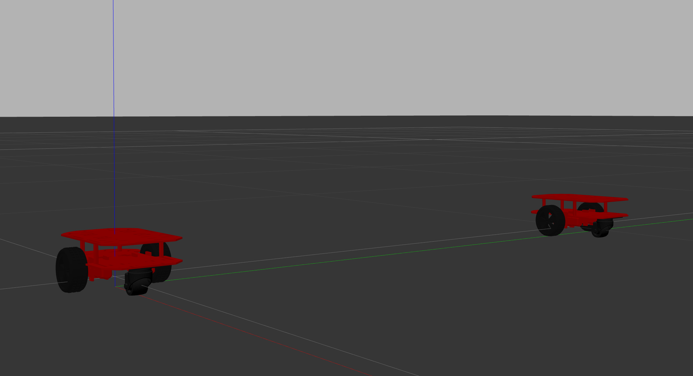

# diff_drive_simple

2-wheel differential drive (multi-)robot in Gazebo




### Launch

Launch single robot:
```
$ roslaunch diff_drive_simple my_robot_world.launch
```

### Configure and launch multi-robot
Multi-robot can be configured in 'robots.launch' for their name, spawn position, and adding more of them


Launch multi-robot:
```
$ roslaunch diff_drive_simple my_multi_world.launch
```


### Controlling the robots
For single robot, publish to:
```
/cmd_vel
```
You can try it out by publishing from the terminal:
```
$ rostopic pub -r 1 /cmd_vel geometry_msgs/Twist '{linear:  {x: 0.1, y: 0.0, z: 0.0}, angular: {x: 0.0, y: 0.0, z: -0.1}}'
```

For multi robot, publish to:
```
/[robot_name]/cmd_vel
```
[robot_name] is set in robots.launch and is currently 'rob_0' and 'rob_1'


### Get poses of the robots
A node 'getPose' continuously gets the robots' names, positions, and yaw angles:
```
$ rosrun diff_drive_simple getPose
```
If you'd like to use this node, starting this node before issuing any control to the robots is recommended to avoid unnecessary problems
